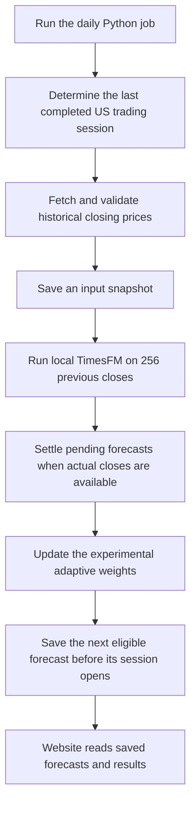
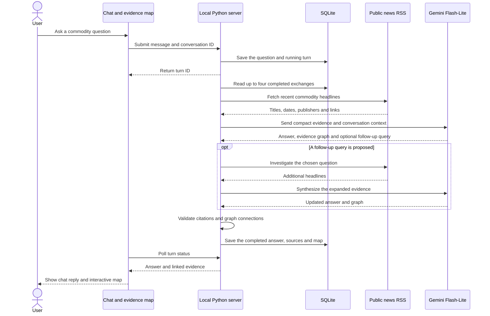

# How YodaX works

YodaX has two independent workflows: daily stock forecasting and on-demand commodity research. They share the website and Python server, but the research agent does not currently change the stock model's predictions.

## Using the website

The homepage introduces YodaX with an animated signal graphic, feature overview and FAQs. Choose **Explore forecasts** for the dashboard or **Ask YodaX** to open Future Market directly. Both use the same local application; saved conversations remain available.

| Section | What you can do |
| --- | --- |
| Overview | Select a company, explore price history, and see the next-session forecast and estimated range. |
| Tomorrow | See the saved forecasts for the next stock trading session. |
| Track record | Compare published predictions with actual closes, or inspect historical tests separately. |
| Methodology | Inspect live predictions, historical replay comparisons, before/after weight changes and downloadable evidence. |
| Future Market | Chat about a commodity, ask follow-ups, and inspect each answer's linked evidence map. |

The currency selector converts stock prices into USD, INR, EUR, GBP, JPY or CAD. It changes the display, not the model's inputs or percentage returns.

## Daily stock workflow



Run the job from the repository root:

```sh
.venv/bin/python -m backend.run
```

The job runs separately from the web server. Opening the website or selecting a stock does not trigger inference. The local development machine has a weekday automation; cloning the repository does not install that schedule. See [Running YodaX](running.md) for timing and setup.

### What the learning loop changes

The adaptive layer blends three estimates: the raw TimesFM output, an unchanged-price baseline, and a bias-corrected TimesFM estimate. Once an actual close arrives, it scores the saved prediction and adjusts the weights for future predictions. Smaller errors receive more relative weight; large errors lose weight. The previously published prediction remains unchanged.

TimesFM's pretrained weights are frozen. This is online adjustment of a forecast blend, not reinforcement-learning fine-tuning. Historical tests do not train the online learner. See [Model and learning loop](model.md) for the scoring rules and references.

## Future Market workflow

For example, choose **Crude oil** and ask: “What is driving oil this week?” Then follow up with: “What evidence would change that outlook?”



The agent chooses its follow-up query from the current evidence. It has one extra research step per message; it does not browse indefinitely. Each new chat message can start another investigation with recent conversation context.

### Reading the map

- **Evidence:** an observation tied to one or more supplied headlines.
- **Hypothesis:** a proposed economic mechanism, such as a disruption reducing available supply.
- **Risk:** a counterargument or condition that could weaken the conclusion.
- **Outlook:** the conditional conclusion connected to the preceding context.

Arrows label the proposed relationship. Click a node for its explanation, source links and connected context. Each answer retains its own map; use **Explore this answer's map** to revisit an earlier response. Zoom controls help inspect the graph.

The server rejects unknown source IDs, invalid graph references and nodes that do not connect to the outlook. These checks establish structural consistency, not factual accuracy or proof of causation.

### Persistence and failures

Questions and results are stored in `data/research.sqlite3`. The browser remembers the current conversation ID. Refreshing restores the messages and polls any active turn. Starting a new conversation leaves previous records in the database; there is no conversation-history picker yet.

Temporary Gemini server errors receive one retry per call. Quota errors stop without retrying or switching models. If the initial answer succeeds but follow-up synthesis fails, the initial answer remains available with a visible limitation. If the server restarts during a turn, that turn is marked interrupted and can be retried.

Research is limited to one active turn and 40 generation attempts per UTC day on this local installation. A normal turn uses one or two calls, or up to four attempts with retries. Every attempt counts. See [Future Market](future-market.md) for key setup, free-tier conditions and troubleshooting.

## Where each component runs

| Component | Location | Responsibility |
| --- | --- | --- |
| Website | Browser | Charts, chat, source links and interactive evidence map |
| FastAPI | Local Python process | Serve the website, read stock results and coordinate research |
| TimesFM | Local daily Python job | Forecast stock closing prices from numerical history |
| Gemini 3.1 Flash-Lite | Google's API | Analyse supplied headline context and generate chat answers and graph structure |
| SQLite and snapshots | Local `data/` directory | Keep forecasts, outcomes, research history and request counts |

The Gemini key stays in the server environment or ignored `.env` file. Model weights, local data and credentials are excluded from Git.

## Current boundaries

The working demo includes stock forecasts, outcome scoring, adaptive blending, currency display, commodity chat and evidence maps. Commodity research currently uses headlines rather than full articles or production datasets. It provides qualitative scenarios, not validated commodity price forecasts.

Connecting research to TimesFM is future work. That requires numerical features with reliable timestamps, leakage-safe evaluation, and a prospective record showing whether those features improve predictions. Public deployment also needs authentication, per-user limits, a durable job queue, monitoring and appropriately licensed data.

## Homepage product story

The homepage has a looping company strip and an interactive, four-chapter world map: news signals, growing demand, historical context and an illustrative outlook. Select any of the six country signals or the historical-data book to inspect the input, or use the chapter buttons and pause control. Signals pulse in place during Signals and Demand. Connections and traveling particles activate only after the YodaX agent appears in Connect, then disappear for Outlook. Reduced-motion preferences disable automatic playback.

This animation is a product concept. Its headlines and outlook are illustrative, and it makes no AI requests. Commodity research and TimesFM price forecasting still run separately.

Country outlines are bundled locally in `demo/dist/world-map.json`, simplified from the public-domain [Natural Earth 1:110m countries dataset](https://www.naturalearthdata.com/downloads/110m-cultural-vectors/110m-admin-0-countries/). Animation behavior lives in `world-story.js`.

The map uses the United States, China, Germany, Japan and United Kingdom: the top five in the [2026 nominal GDP ranking](https://statisticsoftheworld.com/gdp-by-country), based on IMF WEO estimates. India is included as a sixth signal. This is a fixed illustrative selection, not a live ranking. All signals are hypothetical.
